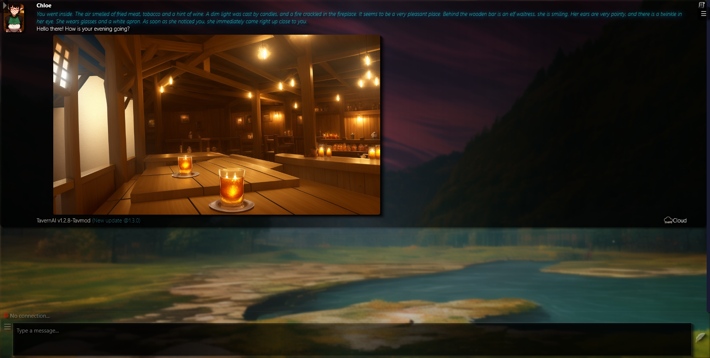
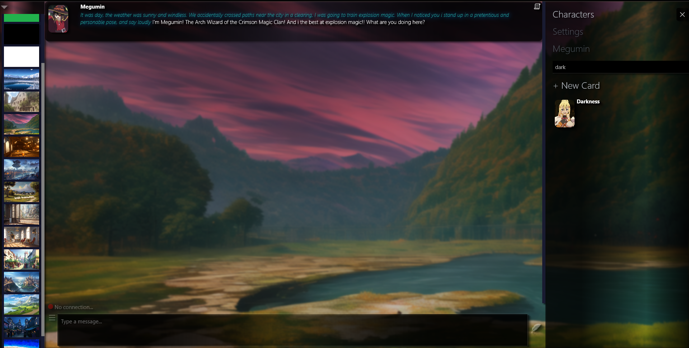

### Tavmod is a modification of [CNCanon1's fork of 1.2.8 TavernAI](https://github.com/CncAnon1/TavernAITurbo)

### [original Tavernai](https://github.com/TavernAI/TavernAI)

## Notable modifications
* Alphabet sort (apparently this is supposed to break something on normal tav? but seems to work without issue)
* auto connect to last used API
* Auto open last interacted character
* Dynamic resizing of chatbox to fit screen if background / character menu is opened
* searchbox for characters
* fixed going past the bounds of the window (no double scrollbars)
* background selector now actually goes to the bottom of the screen
* background shuffler (default 5 minutes)
* chloe actually uses 'tavern.png' as her introductory message instead of 'stardust city.png'
* css overhaul
* (buggy) character name edit
* fix any 'bad' cards (sets a bad cards create_date to date.now())
* greentext, strikethrough, codeblock, inline code, order and unorder lists, table format support, HTML tags in messages, as well as chat selection menu
* system toggles for the following
  * opening left / right menus on startup
  * what menu to select in right nav bar as default 
  * set delay for background shuffler (incl disable)
  * toggle for (attempting to) open last character on startup 
* fix saving changes being extremely laggy and added an indicator for when changes are unsaved / saved
* less if else, more switch statements
* amount of tokens to generate slider for OAI 
* proper rending of style elements (*text* ~~text~~ etc.) within chat selector
* scale support
* custom prompt support

exmaple images (maybe outdated)

